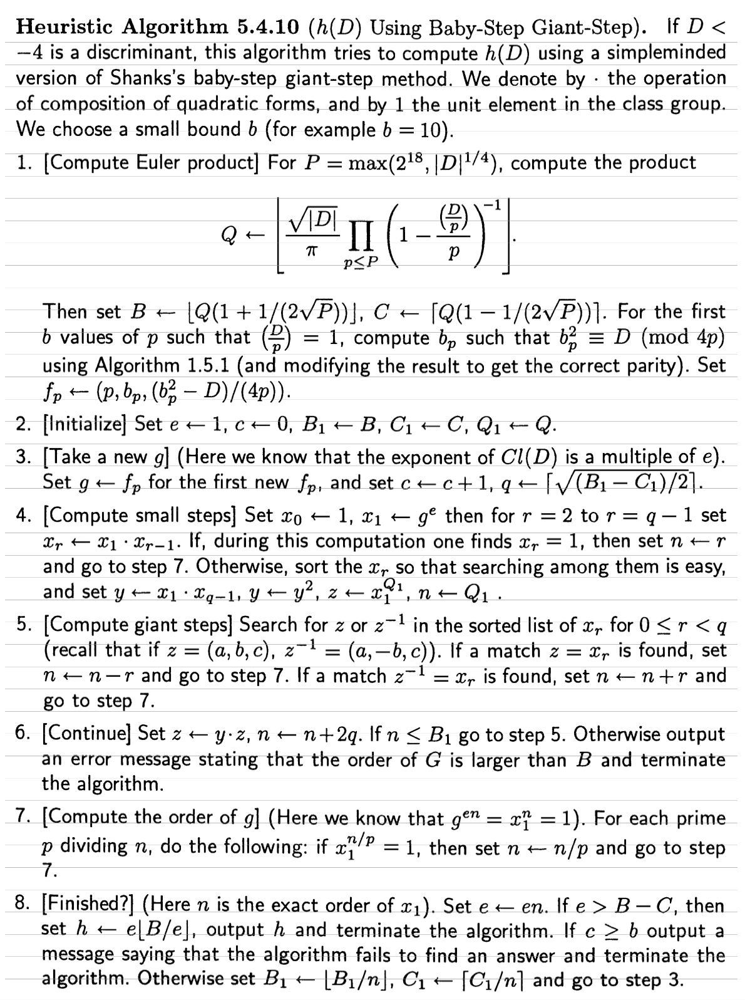
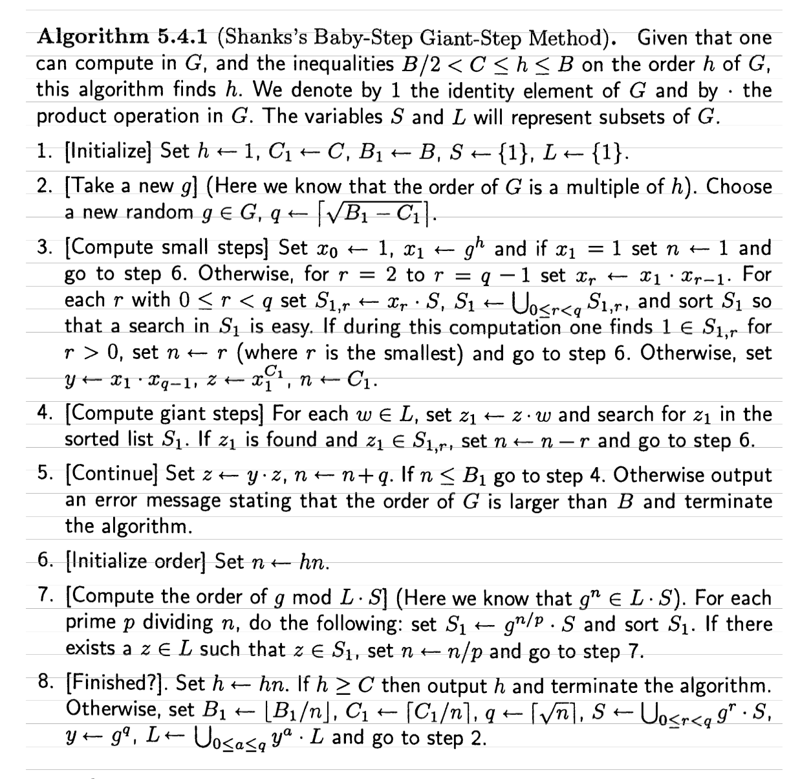

# ClassGroups

:construction: Under construction :construction:

Python implementation of Class Groups of Imaginary Quadratic Fields, where elements are represented as positive definite binary quadratic forms.

## Computing the Class Number

In `class_number.py` we offer a (slighly modified) version of the Heuristic Algorithm 5.4.10 from the third printing of Cohen's "A Course in Computational Number Theory"



The essence of the algorithm is that by computing the Euler product, 

$$
\tilde{h} = \left \lfloor {\frac{\sqrt{|D|}}{\pi}} \prod_{p < P} \left(1 - \frac{\left(\frac{D}{p}\right)}{p} \right)^{-1} \right \rfloor
$$

This is currently implemented as

```py
def euler_product(Cl):
    sqrt_D = sqrt(abs(Cl.D))
    P = max(2**18, int(sqrt(sqrt_D)))
    sqrt_P = sqrt(P)

    Q = sqrt_D / pi
    for p in primes(P):
        ls = kronecker(Cl.D, p)
        Qp = (1 - (ls / p))
        Q /= Qp

    B = floor(Q*(1 + 1/(2*sqrt_P)))
    C = ceil(Q*(1 - 1/(2*sqrt_P)))
    return mpz(Q), mpz(B), mpz(C)
```

We know the class number $h$ within fairly tight bounds. With upper, lower bounds $C < h < B$ we can find $h = \tilde{h} \pm q$ for some $q < (B - C) / 2$. Searching naively for this $x$ would be linear, and we can use Shank's BSGS method to instead search in a space $\sqrt{q}$. This is steps 3-5 in the above algorithm. 

However, I cannot find a way to make this work as Cohen has written in. The implementation above seems to work only about 50% of the time. As such, I have modified steps 5 and 6 to account for this and can now comfortably compute class numbers for $10^{30}$.

There are additional issues encounted by the non-cyclicity of the class group, meaning even when $n$ is found from the BSGS routine, the resulting value can be incorrect. To fix this, I should instead implement algorithm 5.4.1, which feels like a good **TODO**.



## Benchmarks

Some timings of scalar multiplication using different algorithms. Nothng fancy, will eventually swap out with benchmarks

### Naive
```
Created group with 512 bits in 1.7881393432617188e-05 seconds
Performed a scalar multiplication with 511 bit secret in 0.1533510684967041 seconds
--------------------------------------------------
Created group with 1026 bits in 1.8835067749023438e-05 seconds
Performed a scalar multiplication with 1022 bit secret in 0.6584110260009766 seconds
--------------------------------------------------
Created group with 2049 bits in 3.695487976074219e-05 seconds
Performed a scalar multiplication with 2049 bit secret in 3.193856954574585 seconds
--------------------------------------------------
Created group with 512 bits in 1.2159347534179688e-05 seconds
Performed a scalar multiplication with 511 bit secret in 0.14811277389526367 seconds
--------------------------------------------------
Created group with 1024 bits in 2.002716064453125e-05 seconds
Performed a scalar multiplication with 1024 bit secret in 0.6391940116882324 seconds
--------------------------------------------------
Created group with 2047 bits in 3.814697265625e-05 seconds
Performed a scalar multiplication with 2046 bit secret in 3.183690071105957 seconds
--------------------------------------------------
```

### NUCOMP / NUDUPL
```
Created group with 512 bits in 1.71661376953125e-05 seconds
Performed a scalar multiplication with 511 bit secret in 0.12361025810241699 seconds
--------------------------------------------------
Created group with 1026 bits in 2.002716064453125e-05 seconds
Performed a scalar multiplication with 1026 bit secret in 0.474027156829834 seconds
--------------------------------------------------
Created group with 2049 bits in 4.100799560546875e-05 seconds
Performed a scalar multiplication with 2045 bit secret in 2.101064920425415 seconds
--------------------------------------------------
Created group with 512 bits in 1.0967254638671875e-05 seconds
Performed a scalar multiplication with 511 bit secret in 0.10851192474365234 seconds
--------------------------------------------------
Created group with 1024 bits in 1.9073486328125e-05 seconds
Performed a scalar multiplication with 1023 bit secret in 0.4572319984436035 seconds
--------------------------------------------------
Created group with 2047 bits in 3.981590270996094e-05 seconds
Performed a scalar multiplication with 2046 bit secret in 2.0988810062408447 seconds
--------------------------------------------------
```

### Gmpy2 + NUCOMP / NUDUPL

```
Created group with 512 bits in 3.790855407714844e-05 seconds
Performed a scalar multiplication with 507 bit secret in 0.0359799861907959 seconds
--------------------------------------------------
Created group with 1026 bits in 2.2172927856445312e-05 seconds
Performed a scalar multiplication with 1026 bit secret in 0.11339902877807617 seconds
--------------------------------------------------
Created group with 2049 bits in 3.409385681152344e-05 seconds
Performed a scalar multiplication with 2049 bit secret in 0.42668604850769043 seconds
--------------------------------------------------
Created group with 512 bits in 4.76837158203125e-06 seconds
Performed a scalar multiplication with 512 bit secret in 0.026320219039916992 seconds
--------------------------------------------------
Created group with 1024 bits in 5.0067901611328125e-06 seconds
Performed a scalar multiplication with 1021 bit secret in 0.10192584991455078 seconds
--------------------------------------------------
Created group with 2047 bits in 8.821487426757812e-06 seconds
Performed a scalar multiplication with 2046 bit secret in 0.41104888916015625 seconds
--------------------------------------------------
```